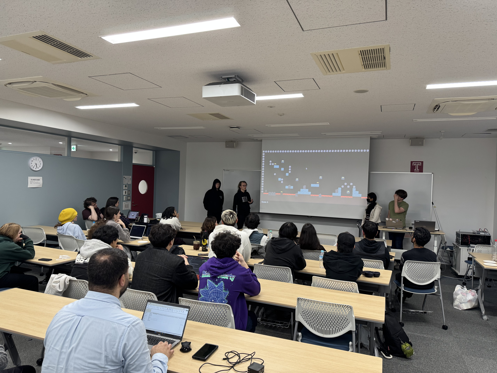

---
# Event Gallery 
Here is the entire array of events organized by the TUJ CS Society and their respective blogs. 

| | | |
|:-------------------------:|:-------------------------:|:-------------------------:|
|  |  |  |
| [SDGs to Startups Hackathon](./Hackathons/SDGS_to_Startups_Hackathon.md)   _(June 20-21, 2026)_ | [TUJ Fall 2025 Hackathon](./Hackathons/TUJ_Fall_2025_Hackathon.md)   _(October 18, 2025)_ | [TUJs First Hackathon](./Hackathons/TUJs_First_Hackathon.md)   _(March 29, 2025)_ |

---
# Complete Event List
List of blogs documenting each event organized and hosted by the CS Society (from latest to oldest): 

<!-- TODO: Add "Artificial Intelligence and the Future of Computer Science" -->

[SDGs to Startups Hackathon](./Hackathons/SDGS_to_Startups_Hackathon.md) _(June 20-21, 2026)_

<!-- TODO: Add Alliz Startup Career Hackathon -->

[TUJ Fall 2025 Hackathon](./Hackathons/TUJ_Fall_2025_Hackathon.md) _(October 18, 2025)_

<!-- TODO: Add Professor Meet and Greet Event -->

[TUJs First Hackathon](./Hackathons/TUJs_First_Hackathon.md) _(March 29, 2025)_

