<!--
5:30 PM - 5:40 PM : The host introduces the event, speakers, agenda, and sets the stage for the first presentation.

5:40 PM - 6:00 PM : “Agentic AI and how it’s transforming Software Development Workflows in IT Companies” a workshop on using AI Agents for software development by Professor Mau Hernandes 

6:05 PM - 6:20 PM : “Machine learning for Dummies” by Cassady Mead

6:20 PM - 6:35 PM : “The history of computer science and its transition from Web into the age of AI” by Ai Sekine

6:35 PM - 6:50 PM : “How to make the most of your university years to dominate the job market in the current CS landscape” by Ryuto Thai

6:55 PM - 7:00 PM : Short Break

7:00 PM - 7:20 PM : “How to Build Your Career in the Age of AI: Industry Reality, Engineering Skills, and the Future of Work” by Hyunho Kim

7:30 PM - 8:00 PM : End of speaker presentations. Post event discussion and Networking (with free snacks!)
-->

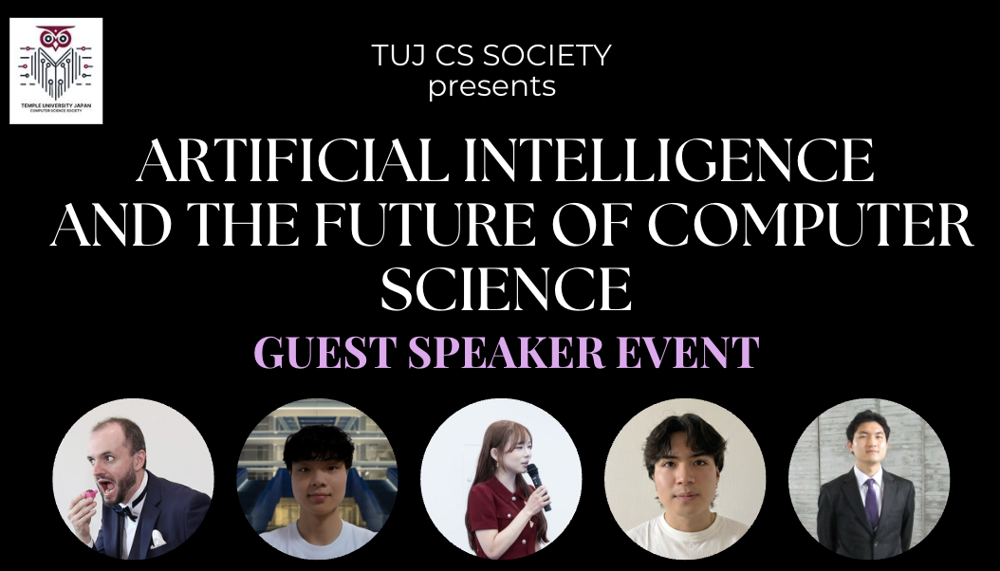

This summer, we had professors, industry professionals, and students come to TUJ to present their experiences with AI and how they used it to improve their knowledge, tacket the current Computer Science (CS) job market, and how to navigate the software development space with AI. 

## List of Speakers

Here's the array of speakers we had at this event.

### Professor Mau Hernandes 

Professor Hernandes is an Adjunct Assistant Professor at Temple University Japan (TUJ). He has a Masters Degree in Mathematics from the Universidade de São Paulo (Brazil) and a PhD  Computer Science from National Institute of Informatics - SOKEN (Japan). His areas of expertise include logic, deep learning applications to finance, and applied machine learning. Prof. Hernandes brings over a decade of experience in data science consulting, having worked with major Japanese companies and multiple startups in Japan, including his own. He has been closely observing how AI is affecting software development in Japan.

Read about his presentation and workshop: [Agentic AI and how it’s transforming Software Development Workflows in IT Companies” a workshop on using AI Agents for software development](#agentic-ai-and-how-its-transforming-software-development-workflows-in-it-companies-by-professor-mau-hernandes)

### Cassady Mead 

Cassady is a fourth year computer science student at TUJ. He is an experienced machine learning engineer and software developer. He is interested in game development and building reliable software and mobile applications. He is proud to be deaf and wants to share his experiences as a cs student who has gained meaningful experiences through TUJ and in Japan despite having hearing difficulties. 

Read about his presentation: [“Machine learning for Dummies” by Cassady Mead](#machine-learning-for-dummies-by-cassady-mead)

### Ryuto Thai 

Ryuto Thai is a recent graduate from TUJ. He is currently working as a Software Engineer at Amazon Japan, and has interned at Moët Hennessy Louis Vuitton (LVMH) at Guerlain before. He started his dream internship at Amazon at only 20 years old, graduated from TUJ with a CS degree and Economics minor in just three years. He has also competed in five hackathons, all of which he has won in, including one backed by Y Combinator (YC). He is an experienced student and knows how to navigate through university and the CS job market. He will be sharing his experiences and pro tips to beat the career ladder at this event.

Read about his presentation: [“How to make the most of your university years to dominate the job market in the current CS landscape” by Ryuto Thai](#how-to-make-the-most-of-your-university-years-to-dominate-the-job-market-in-the-current-cs-landscape-by-ryuto-thai)

### Hyunhoo Kim

Hyunho Kim is an AI Security Solutions Architect who most recently supported AMD Japan, specializing in AI Security, edge AI, and AI PC architectures across CPU, GPU, and NPU systems. His experience spans AI product management, solution consulting, hardware-aware AI optimization, and AI security. His research background includes reinforcement learning, comparative AI algorithm performance, and energy-optimal allocation problems. He has also contributed to policy discussions and advisory work related to science and technology, public-sector cloud, AI, and national security strategy in Korea. Hyunho was also recently invited to participate in the Berkeley Quantum Nexus ecosystem, where his interests include Quantum AI, post-quantum cryptography, and the commercialization of emerging technologies. Hyunho regularly speaks on the future of AI, AI infrastructure, engineering careers, and how students can prepare for the changing technology industry.

Read about his presentation: [“How to Build Your Career in the Age of AI: Industry Reality, Engineering Skills, and the Future of Work” by Hyunho Kim](#how-to-build-your-career-in-the-age-of-ai-industry-reality-engineering-skills-and-the-future-of-work-by-hyunho-kim)

### Ai Sekine

Ai is a fourth year computer science and mathematics student at the University of Pittsburgh. She is a prominent speaker for SIGBOVIK and gives presentations about applied CS and Math algorithms at various conferences. She hopes to get into researching algorithms after graduation at a masters program. She joins a lot of Hackathons, CS events, and is based in Tokyo, Vietnam, and Pennsylvania and will be offering her unique international experiences to the campus of TUJ. 

Read about her presentation: [“The history of computer science and its transition from Web into the age of AI” by Ai Sekine](#the-history-of-computer-science-and-its-transition-from-web-into-the-age-of-ai-by-ai-sekine)

--- 
# "Agentic AI and how it’s transforming Software Development Workflows in IT Companies" by Professor Mau Hernandes

<!-- TODO: ADD PROF MAU SLIDES FROM OUTLOOK EMAIL IF U CAN PLS -->

## AI-driven Software Development 

Professor Mau Hernandes gives a very insightful presentation on how Artificial Intelligence (AI) is being used in the current software development environment and how most workflows have changed due to the introduction of agentic coding tools such as Claude Code, Codex, Cursor, and other such tools. He shows us how to build a quick telegram bot that sends you messages from a server and logs your responses. It's a short survey bot but he shows the audience how easy it is to code something on your phone in a matter of 15 mintues. 

## Using AI Effectively and how Different Teams in Companies use it

He explains that business focused employees are encouraging other people to use AI and sometimes use AI themselves to get to know a bit of the code or even ask about technical improvements that can be made to the application. He talks about how that's the main difference between people that have some base technical knowledge and the people that don't. People that do know the basics can prompt way better, in a token-efficient way, saving not only money, but time as well. He emphasizes the importance of how to stay up to date with technical information, and how to get better at prompting models by understanding the underlying technology at an expert level. 

## Develop "AI-friendly" software

Professor Hernandes closes his talk by saying how important developing **for AI agents** has become. He explains that everyone will be using and building on top of your software using AI, so not only is your job to make good software, but also make software that the AI can interact with easily. He explains that his talk isn't meant to show people how they will be developing software using AI, but how other people will be interacting with their software using AI agents and agentic coding tools.

## Audience Questions

1. **"Do you still recommend people choosing a Computer Science (CS) major given the current state of AI and the job market?"**

Professor Hernandes still agrees that choosing CS is a good call. He mentions he may be biased due to being a CS and Mathematics professor, however, he emphasizes that CS isn't all about coding. Though coding is a big factor of what people do, development and working in the Information Technology (IT) field is about understanding user / client requirements, making good, strong developer solutions to dynamic problems. He also mentions how AI is just a tool and without the right person to use it, it becomes nothing more than a waste of cash. My favourite quote from Professor Hernandes' answer is "AI Is just a tool that writes horrible code that needs hours of debugging", and he mentions how a computer scientist's job isn't just writing code but it's understanding the deeper systems to make them more effective, efficient, optimal, and failsafe. He closes his answer by saying that it's a good time to be a computer scientist, not just someone who writes code. 

2. **"How do you think the market of tokens will change? They're already increasing in price, won't it just become more expensive to use LLMs? What happens to AI-driven development then?"**

Professor Hernandes states that people use tokens horribly. Though they are cheap now, no one can predict how the market will shift in the near future. He's worried that people aren't saving enough tokens and don't really mind wasting some. He closes by saying how he's worried that people might get too dependent on AI companies and the services they offer and he proposes in-house solutions and people to become less dependent on AI in general. There isn't an unlimited supply of resources you know.

3. **Professor, you focused a lot on how to develop for AI agents, how do you suggest we make software that's 'AI friendly'?"**

Professor Hernandes says he doesn't know the complete answer to it yet. But a couple of ways he suggests is to make an accessible MCP server, giving any agent all the tools with clear description it needs to do tasks through your application, kind of like an Application Product Interface (API) but for coding agents. He also mentions how some websites, for example [Cloudflare](https://www.cloudflare.com/) have a Large Language Model (LLM) text file with clear instructions on how to parse their website [Cloudflare's LLM text file](https://developers.cloudflare.com/llms-full.txt). He suggests building instructions in your app itself to instruct any agents that autonomously come across your software so they can be instructed well on exactly what to do.

_Side Note: Professor Hernandes' talk re-establishes the importance of how to use AI efficiently and not get lazy. Sorry for the self-insert, but here's a blog I wrote that is slightly related to this topic:_ [Don't get Lazy with AI development](../Member Blogs/Are_we_reducing_the_amount_of_work_or_creating_more_by_using_AI_in_Software_Development.md)

---
# "Machine learning for Dummies” by Cassady Mead

<!-- Cassady explains Machine Learning in the easiest ways possible. A short differentiation between how traditionally all rules are hard-coded and how in machine learning. My favourite quote from his presentation was "Machine learning models are like a kid that is pointing at random objects and figuring out which ones are actually sticks, but they never get bored". 

He is proudly deaf which leads into the next part of his presentation where he wants to change that a lot of people don't get accessibility help.   -->

<!-- TODO: Review from slides that he sent over Discord -->

## Introduction

Cassady explains Machine Learning in the easiest ways possible. A short differentiation between how traditionally all rules are hard-coded and how in machine learning. My favourite quote from his presentation was "Machine learning models are like a kid that pokes at random objects with a stick to figure outwhat they are... except it never gets bored". 

## Accessibility Issues

Cassady talks about how he is proudly deaf which leads into the next part of his presentation where he wants to change that a lot of people don't get accessibility help. He explains that over 70 million people around the world rely on sign language as their primary languge. However, the people that can hear don't understand it. What about computers? even more clueless.

## Sign Language Recognition (SLR) - His Solution

He explains his solution, the "Sign Language Recognition (SLR) model". He uses a camera to capture his live hand gesture, detect what it is, using a ML model to classify the gesture and then output the real time translation as text. I could explain how he built it, but it's easier to understand from his slides:

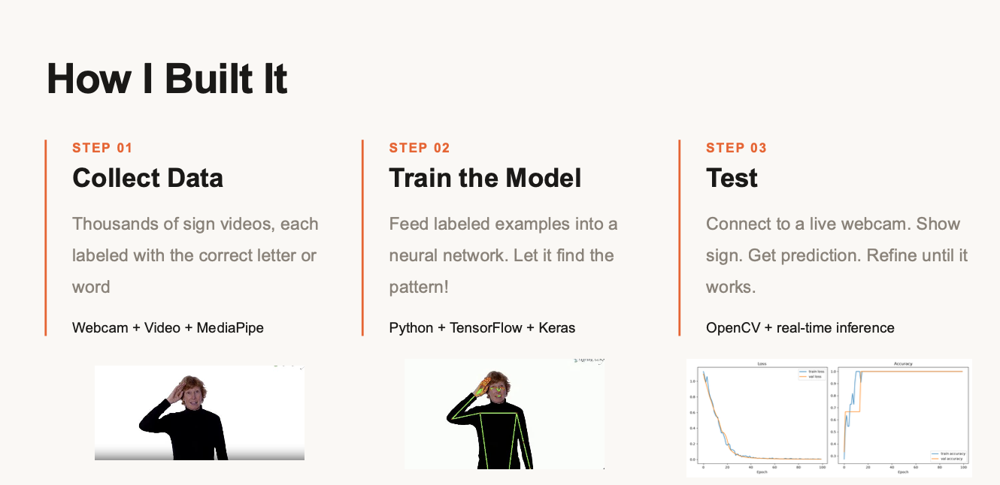

## Live Demo

Here, Cassady shows us a hand sign and how the model recognizes it. You can see the text on the top left of the screen of what the model matched the sign it saw on the screen. 

| | | | |
|:----:|:----:|:----:|:----:|
| 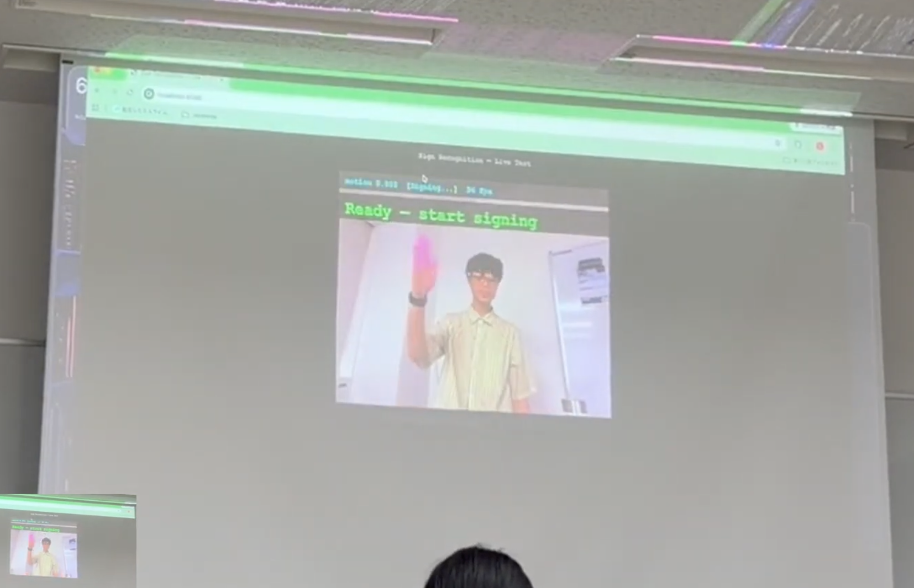 | 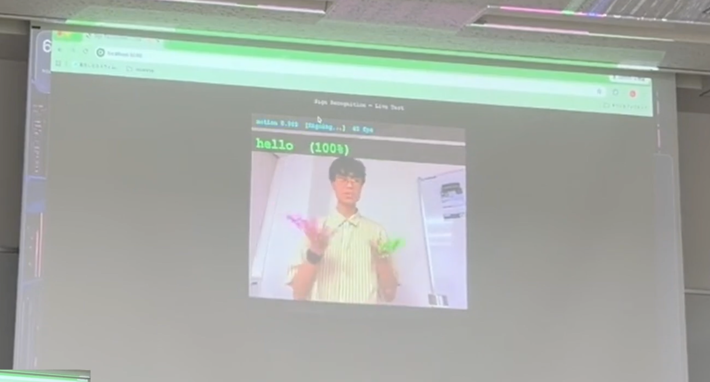 | 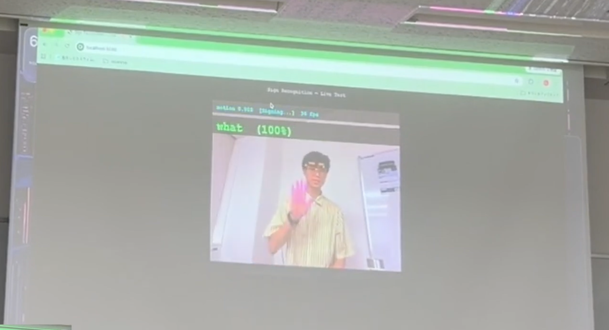 | 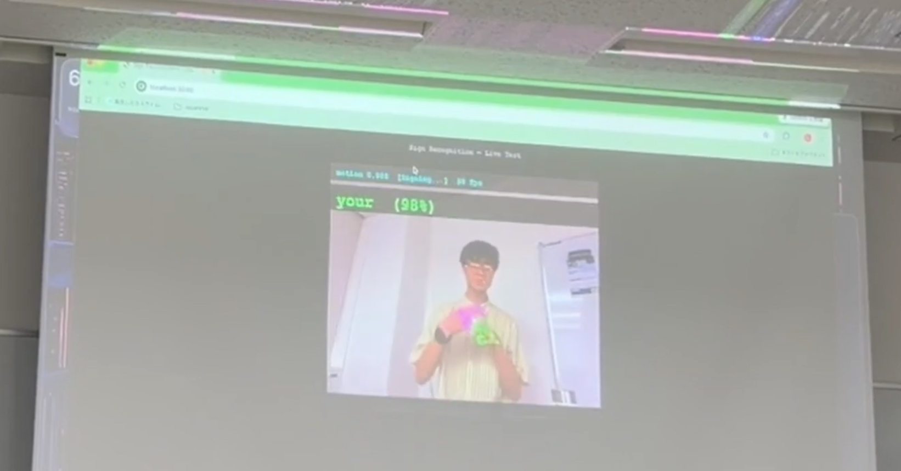 |
| 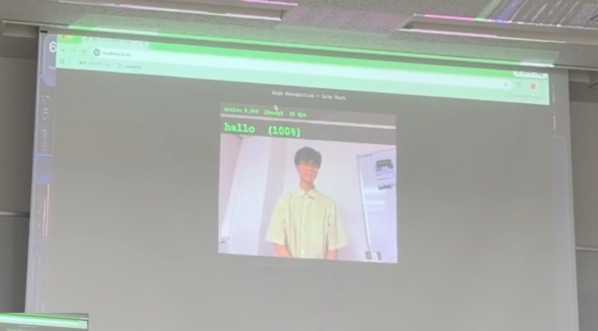 |  | 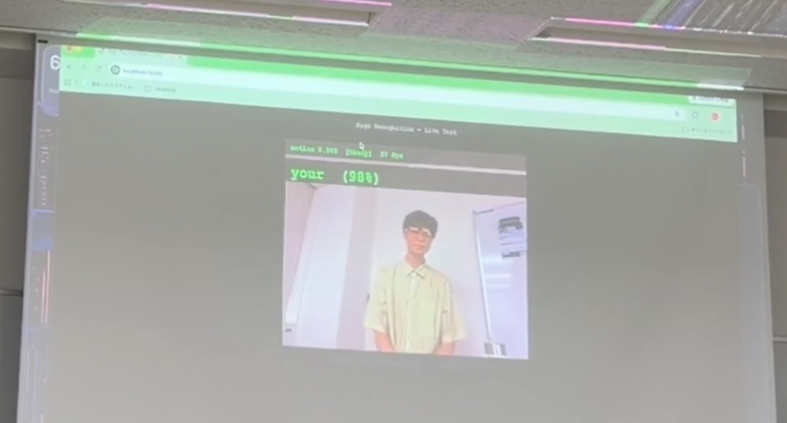 | 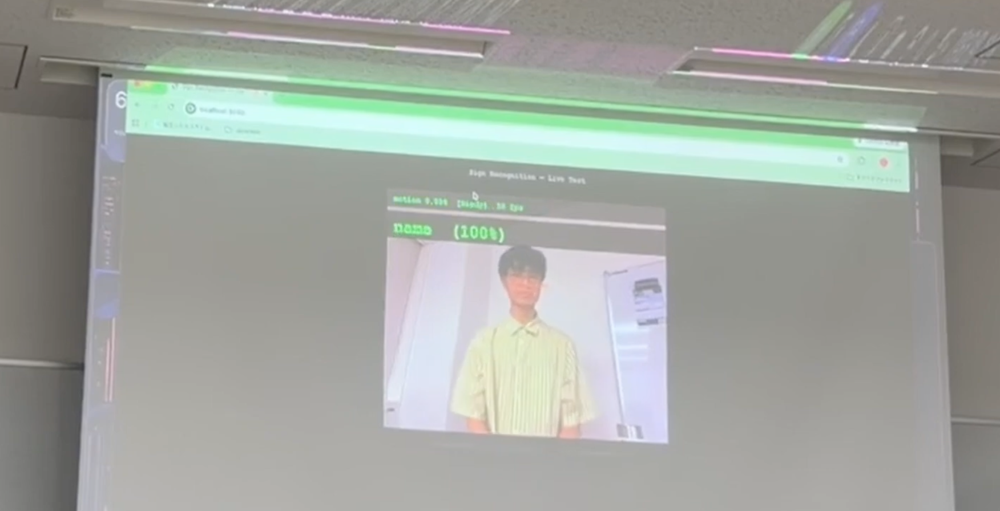 |
| _"Hello"_ |_"What"_|_"Your"_|_"Name"_|

> [!info] Full Presentation and Complete Demo on YouTube
>
> You can watch Cassady's full presentation, along with the live demo, and audience questions on YouTube: [Cassady's Presentation](https://youtu.be/NiCfMc1VmUw)

--- 
# “How to make the most of your university years to dominate the job market in the current CS landscape” by Ryuto Thai

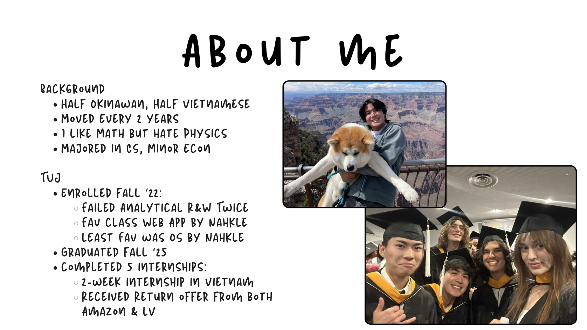
_Image: Who am I? (Credits: Ryuto Thai)_

Ryuto is a recent TUJ graduate working full time for Amazon under their Manga team as a Software Developer. He first used to work as an intern at Amazon Furusato which is a way for people to offer tax donations to their hometown by buying products from that specific location. He explains his life now as a full-time _Amazonian_, and his work culture. He talks about how there are certain **On-Call Engineers** that are dedicated for incidents and any downtime events. 

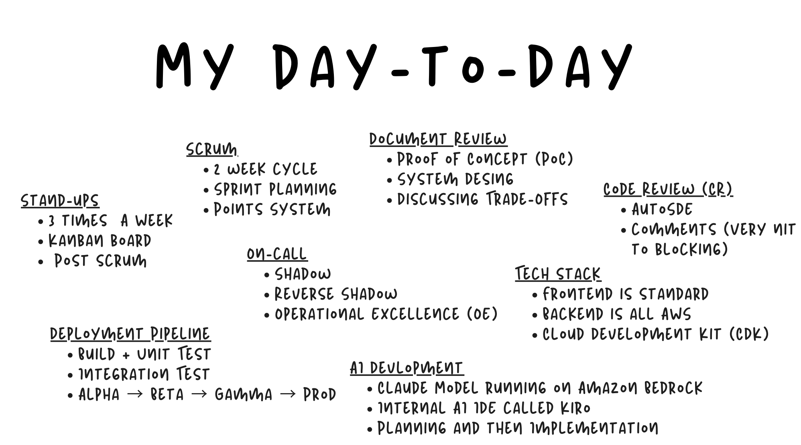
_Image: A day in the life of Ryuto's work as a SWE at Amazon. (Credits: Ryuto Thai)_

## On-Call Engineers

On-call engineers must be available at all times, doesn't matter if it's the middle of the night, 3 AM or 4 AM. They can't go too far over the weekends and if they do, they must carry their laptop with them and hope their hotspot holds. Because as an on-call engineer, you can get paged during any time of the day with an alarm equivalent to that of an Earthquake alert on most phones. Ryuto plays us a clip and it's equally loud as it is scary. Luckily, on-call engineers rotate every two weeks or often so. He also explains that he has about a 3 month buffer where he doesn't have to take the on-call engineer role, but he has to shadow an on-call engineer and watch what they do when they're dealing with incidents. Though he doesn't have to do anything or code, he still has to watch and learn from the other on-call engineer whenever there's an incident. There's also times when he has to play the role of an on-call engineer and there's another person shadowing him.   

## Getting a Job in the Current CS Landscape 

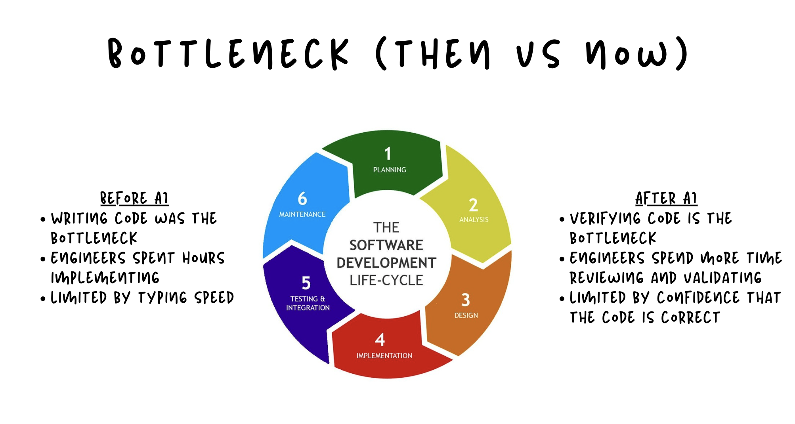
_Image: Bottleneck Changes in the SDLC. (Credits: Ryuto Thai)_

Ryuto explains how software development is not just coding. Going off of what Prof. Hernandes said in the very first presentation, he explins the bottlenecks in the Software Development Life Cycle (SDLC) have changed. Before AI, the bottleneck was writing code. But now, after the introduction of AI, reviewing code is the bottleneck of any SDLC. 

How to survive the market? Ryuto explains what worked best for him wasn't just staying closed off within the university and his courses, but going out, exploring, and meeting new people. He also explains how important it is to go out to networking events and get connections, because that will give you the reputation, trust, and backing needed for most companies to accept or interview you even. 

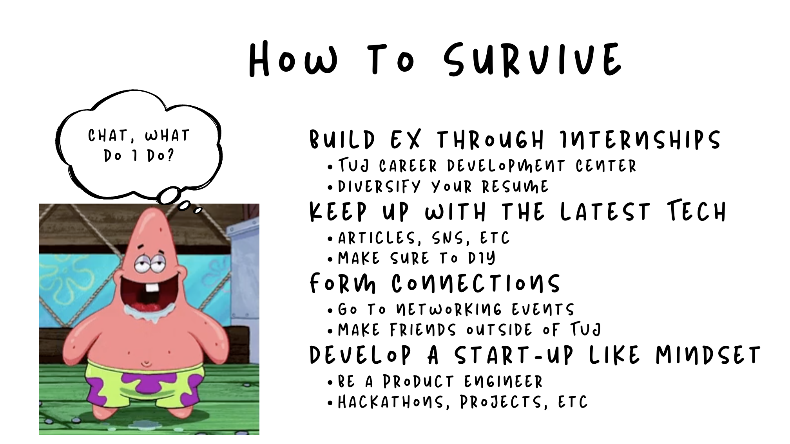
_Image: How to survive the current CS job market. (Credits: Ryuto Thai)_

He said to build your experience from internships. He advices TUJ students to use the [Career Development Office (CDO)](https://www.tuj.ac.jp/career-support) from your very first year, look for internships, better your resume, start applying, and staying ahead of the curve. 

Finally, he talks about the importance of staying up to date with new technology trends and always being curious. He advises not only to consume information and news about the latest trends but also to get your hands dirty and try stuff out for yourself. He exclaims how whatever you consume, you should try and make it into something actionable. In this way you consume ten times more info than actually just reading it.

## Staying Curious

Ryuto's last slide are a set of quotes: "I have no special talents, I am only passionately curious" and "ooh ooh ah ah", one by Albert Einstein, and the other by Curious George, I'll leave which one belongs to who upto you. Two icons, same idea, the point is to be curious. Curiosity is your cheat code, don't be afraid to ask questions during meetings, doing projects because you have no idea what it is, get deep in the codebase just to understand the overall application, and be as curious as you can in anything and everything. 

## Key Takeaway - "Be a 10x Curious Engineer"

Many people are not ten times curious. Everyone that he's met at Amazon are into AI and are smart, but what differentiates amazon engineers is that they are some of the most curious people Ryuto has met in his life, they're genuinely interested in things and they want to have answers to their questions immediately. This mindset is genuinely what you need to increase your chances in the current job market. The final takeaway? Be as curious as possible.

## Audience Questions 

1. **How fast is an Amazon development cycle, from the presentation, it seems pretty fast."** 

In Ryuto's words, yes, it is faster in terms of deployment, if it breaks they fix it later, but they focus on fast deployment, whereas companies like Google focus on getting the tech right. Obviously, he explains that they have to make things that don't break and to ensure this there is a awfully long list of testing environments the features they roll out have to get through. Before they even push some code, they have to build and unit test, then go through integration testing, and only after some linter checks and a lot of code-style checks, typechecks, and so on, they can push code. Then the testing cycle begins with a mind-blowing 4 different environments: Alpha -> Beta -> Gamma -> Prod, where the differences include different types of testing and different environments at each stage.  

<!-- Review from slides: https://canva.link/2474a0jm9ky5mz5 -->

2. **How big is the number on your paycheck?** 

_Guys, keep the questions relevant to the presentation please!_

---
# “How to Build Your Career in the Age of AI: Industry Reality, Engineering Skills, and the Future of Work” by Hyunho Kim

Hyunho Kim introduces a bit about himself talking about how he was originally he was a agriculture major and not related to CS at all. He explains that he first started working as a Salesforce Consultant, and then moving to AMD. He then answers some common student questions that were collected before the guest speaker event was planned:

## What skills students need and what they should prepare for the current CS job market and IT industry?

He explains that the basics and fundamental concepts you learn in university are still very important. He states that those concepts never go away and never change, and they're always there and used. He explains how concepts he studied in Linear Algebra during his undergrad years, he used on the job to solve a problem. He also explains that AI is not clean. He emphasizes what AI is at the end of the day, just a statistical model organizing data that offers the most possilbe answers. He says that generic answers, AI can answer really well but specific cases, it'll suck at the job, most probably because they're not in the thousands of the datasets it has been trained on. At the end of the day it's just a prediction algorithm and it's hard to make a fully autonomous workflow. 

## How to avoid getting replaced by AI?

He urges people to get deep into AI. He tells the audience that most people read about it but don’t prepare at all. He recommends people study a bit more into how AI works, you don’t need to know everything, but knowing the fundamentals and the fundamental algorithm will get you far. Learning a bit about Natural Language Processing (NLP) and understanding how tokens are broken down and processed can help you get better with prompt engineering and using AI in general.

## How AI is affecting the hardware industry and would it be good to improve hardware / other technical skills?

He also explains from AMD's point of view that there are a lot of big changes in the hardware industry in the last 5-6 years. Kim states Two fundamental challenges to physical AI : 

1. It's very hard to get physical training data. For Large Language Models (LLMs), you can just use free textbooks, online forums, online open source repositories, and everything that's for free on the internet, but for physical models and for physical robots, how do you get specific behavioural data. Think about how much money and time and human resources it’ll take. This is the software problem for physical AI.

2. Second, the hardware problem is that motors are super expensive. This is a real physical hardware limitation and is not easily overcome. How can one supply motors and batteries to robots on demand? How can they keep getting replaced, and how can they be efficiently maintained without too much expense and human resources? 

> [!info] Full Presentation on the Discord
>
> There are a lot of other topics Hyunho Kim explored in his topic, I cannot do enough justice to how insightful his talk was. You can request for the full talk on our Discord server, or by messaging me directly.

---
# “The history of computer science and its transition from Web into the age of AI” by Ai Sekine 

_There's a lot of topics Ai touched on, I'll simply summarize the rough history of CS and how it led into the current age of AI by mentioning the main events in the timeline presented by AI (credits to her and her slides):_

**Early Computing Devices**
- 3000 BC: Abacus invented in ancient Mesopotamia and Egypt
- 1623: Wilhelm Schickard creates the Stepped Reckoner
- 1642: Blaise Pascal invents the Pascaline calculating machine
- 1673: Gottfried Leibniz develops the Stepped Reckoner

**The Analytical Engine**
- 1822: Charles Babbage designs the Difference Engine
- 1837: Babbage conceives the Analytical Engine
- First programmable computing device in history
- 1843: Ada Lovelace writes the first computer algorithm

**The Age of Mechanical Calculators**
- 1850s-1920s: Mechanical calculators dominate computation
- Used extensively for scientific and engineering calculations
- Foundation for understanding computational principles
- Led to development of data processing machines

**Electromechanical Computing**
- 1890s: Herman Hollerith invents electric tabulating machine
- Used for 1890 U.S. Census
- Reduces census processing time from 8 years to 1 year
- Foundation of IBM company

**Early Electronic Computers**
- 1930s: Alan Turing develops theoretical computing concepts
- 1941: Konrad Zuse completes the Z3 computer in Germany
- 1943: Colossus computer built to break Enigma codes
- 1946: ENIAC completed - first general-purpose electronic computer

**The First Generation (1946 - 1956)**
- Computers based on vacuum tubes
- ENIAC: 30 tons, consumed 150 kilowatts
- Programming in machine code and assembly language
- Very expensive, limited to research institutions and government

**The Second Generation (1956 - 1963)**
- Transistors replace vacuum tubes
- Smaller, faster, more reliable
- Programming languages emerge: FORTRAN (1956), COBOL (1959)
- Commercial availability increases

**Key Figures in Early Computer Science**
- Alan Turing: Theory of computation and artificial intelligence
- John von Neumann: Computer architecture design
- Grace Hopper: Compiler development and programming languages
- Donald Knuth: Algorithm analysis and computer programming

**The Third Generation (1964 - 1971)**
- Integrated circuits (IC) replace transistors
- IBM System/360 family becomes industry standard
- Time-sharing systems enable multiple users
- High-level programming languages become standard

**Software Engineering Emerges**
- 1960s: The 'Software Crisis' identified
- Growing complexity of software systems
- Need for formal methods and best practices
- Birth of structured programming methodologies

**The Fourth Generation (1971 - 1980s)**
- Microprocessors introduced by Intel
- Personal computers become available
- Apple II (1977), Commodore 64 (1982)
- Software industry begins to boom

**The Personal Computer Revolution**
- 1981: IBM Personal Computer launches
- Apple Macintosh (1984) introduces graphical user interface
- Computing becomes accessible to individuals
- Home computing industry grows rapidly

**The Internet Era**
- 1960s: ARPANET project begins
- 1974: TCP/IP protocol developed
- 1983: ARPANET officially adopts TCP/IP
- 1989: World Wide Web invented by Tim Berners-Lee
- 1990s: Internet becomes public and commercialized

**Software Development Evolution**
- 1960s: Structured programming (Dijkstra)
- 1980s: Object-oriented programming (C++, Smalltalk)
- 1990s: Java and dynamic languages emerge
- 2000s: Open source software movement expands

**Artificial Intelligence Development**
- 1956: Dartmouth Summer Research Project
- Birth of AI as an academic discipline
- 1966-1974: First AI winter begins
- 1980s: Expert systems gain popularity
- 2010s: Deep learning and neural networks revolutionize AI

**Mobile and Cloud Computing**
- 2000s: Mobile devices become powerful computing platforms
- 2007: iPhone launches, revolutionizes mobile computing
- Cloud computing services expand (AWS, Azure, Google Cloud)
- Computing becomes ubiquitous and always-on

**Modern Computing Paradigms**
- Big Data: Processing massive datasets
- Machine Learning: Algorithms that learn from data
- Cybersecurity: Protecting systems and data
- Quantum Computing: Emerging computational frontier

**Key Milestones Summary**
- Computation foundation: Abacus to Difference Engine
- Electronic era: ENIAC to mainframes
- Personal computing: Microprocessors to smartphones
- Internet age: Web to cloud computing
- AI revolution: From expert systems to deep learning

> [!info] Full Presentation on the Discord
> 
> You can catch her talk in the fully recorded video which is available on our Discord server!

# Author Comments
Written by Bhushith Gujjala Hari

A great event! I really enjoyed organizing this all within two days. That's right, I planned this thing on Thursday, July 2, 2026, and somehow had finalized all the speakers by the night of Friday. It was a very rushed event but overall, I'm really glad it all came together for a fun, insightful, and informational event.

