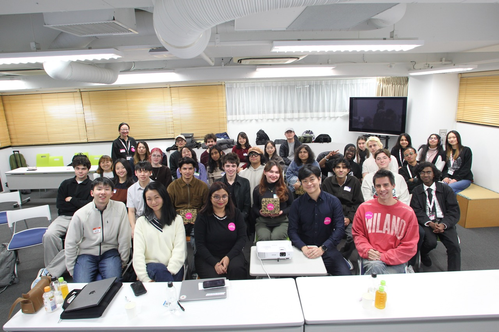
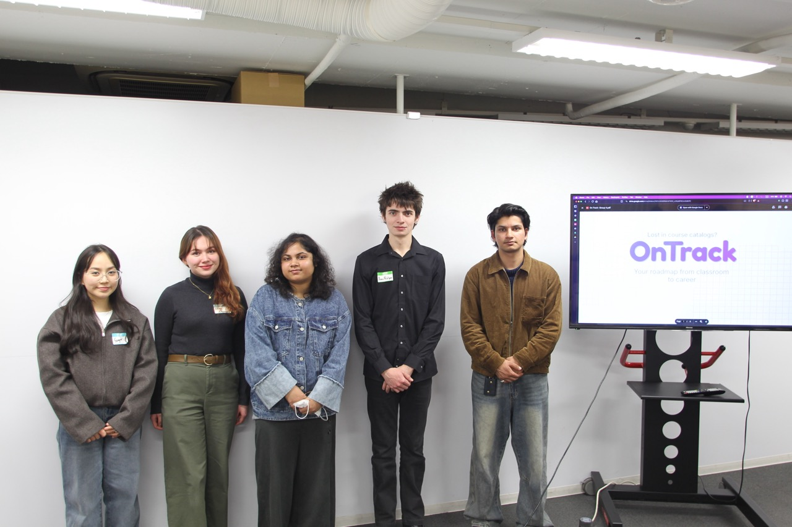
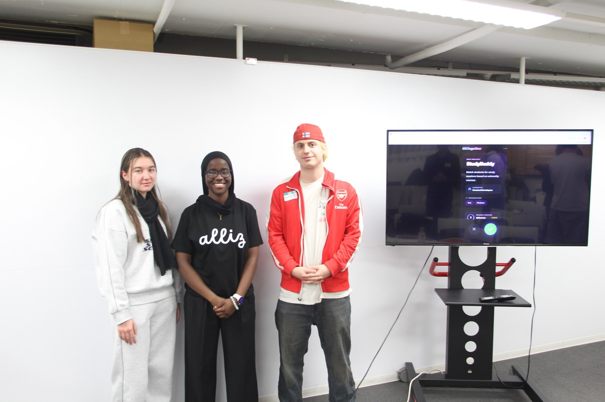
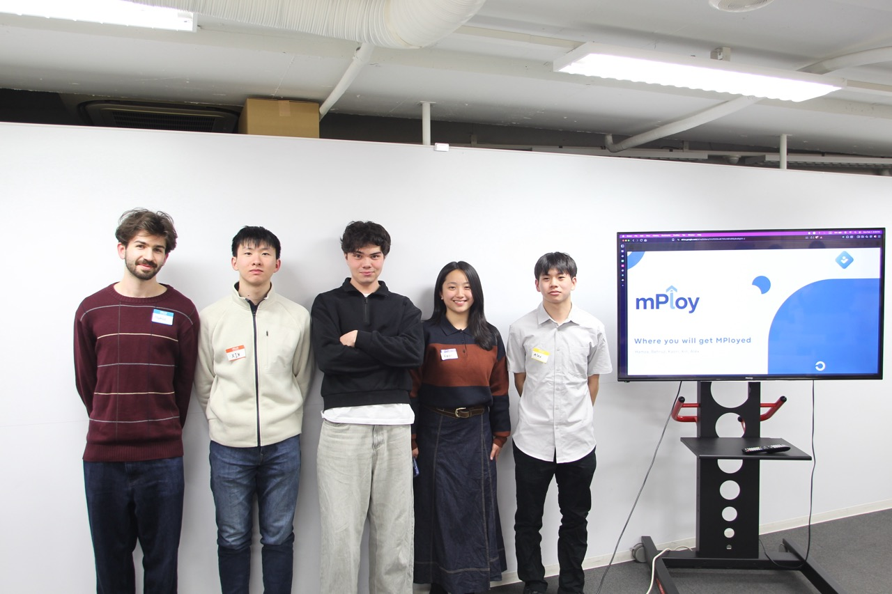
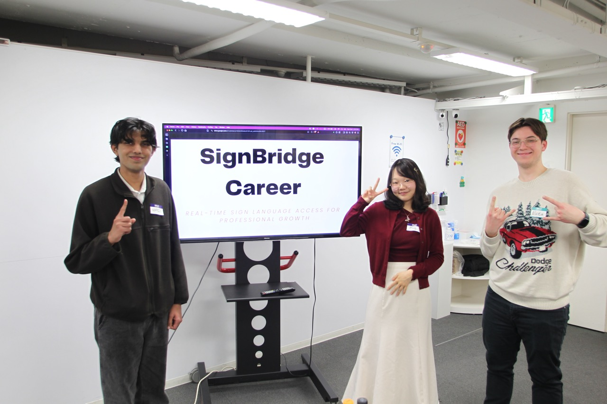
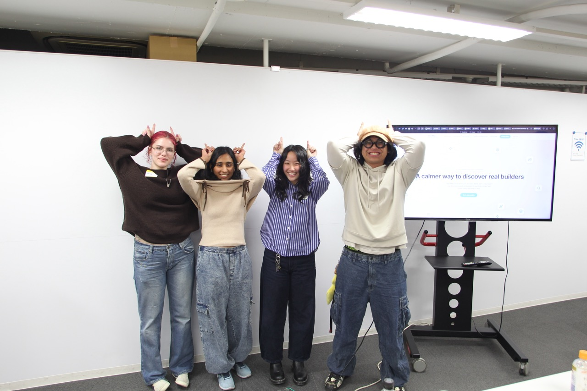

# Introduction - TUJ CS Society x alliz

We organized the Alliz: Design the future of Career and Work hackathon!

We got the chance to mentor, organize, and host the Alliz hackathon this past weekend. The results of the hackathon were five amazing teams coming together to build their own solutions to the problem(s) students face in the current world trying to find internships, plan for their future, and work on career opportunities. 

The event was amazing, fun, and still stressful. It was an unique experience to see the solutions teams came up with to the problem, the progress they made within the short time of only one day of actual coding, and how they presented their solutions. 

This was also the first external event that was going to be hosted at TUJ. This made it very exciting, the TUJ CS Society had a chance at showing people outside of TUJ what the society and the students of TUJ are capable of. 

---
# Teams

Shoutout to all of the teams who participated in the Hackathon! Though it hurts to pick only one winner due to the unforgiving rules of a hackathon, every team did incredibly well and took home a furnished project they can add to their profiles!

**Congrats to the winners of the Hackathon, Team OnTrack!**

## Team OnTrack

==(WINNERS!)== **OnTrack**: AI-powered college planning system aligning coursework with career goals.

_Team OnTrack: Cassey Colobong, Owen McGlynn, Ganga Gurung, Krishna Pandey, Anish Mainali_

[OnTrack Project GitHub](https://github.com/omcglynn/Universityschedulemakercopycopy)

## Team Atakk

**GitTogether**: Collaborative platform connecting aspiring developers for projects.

_Team ATAKK: Aisha Kyobe Natebwa, Thomas Nitcheu, Aria Kurbanbaeva, Koyu Fuke, Kolby Scott Hart._

[GitTogether Project GitHub](https://github.com/Aisha173/GitTogether.git)

## Team mPloy

**mPloy**: Personalized job finder that matches student skills directly to employment opportunities.

_Team mPloy: Alexander Buenaseda, Hamza Mustafa, Behruz Omonullaev, Kaori Shimoda, Xin Luo_

[mPloy Project GitHub](https://github.com/banneddb/mploy)

## Team SignBridge

**SignBridge Career**: Real-time sign language access platform for inclusive professional growth.

_Team 01: Nikita Slobodenyuk, Ali irfan Kapan, Anastasia Sasaki, Meg E., Muhammad Haris Shakeel,_

[SignBridge Project GitHub](https://github.com/SputnikScripter/Alliz_Hackathon_01Group.git)

## Team Utoe

**TalentMap**: Project portfolio-based hiring solution matching students with hiring companies.

_Team Utoe: Brilliant Aksan, Maya Rose Martinez, Naomi Shimoda, Snigdha Tunuguntla, Tai._

[Team Utoe's Project GitHub](https://github.com/brilliantaksan/Utoe)

---
# Author Comments <TODO>

Written by Bhushith Gujjala Hari.

I have to say a special thanks to the main co-organizer of the Hackathon and founder of Alliz, and a special thanks for giving me the wonderful opportunity to be a host at this hackathon, Congqin Chen.

This was also the first event that had live mentors helping each team out. Thanks to all the mentors who helped each team, gave feedback, and supported every team in their project: Junko Fujiwara, Emiko Shimono, Donald Murataj, Bhushith (me!), and Gustavo Minoru Minetoma Alves.

Finally, it was amazing meeting the judges who gave meaningful, real-world feedback, and chose the winners: Snehal Shinde, Jet Son Tan, CSM, MBA, Diogo Almeida, and Yan F. Some of these judges also helped the TUJ CS Society judge and support future Hackathons, so that was very helpful, and I'm glad to have met them.

This was also the first event where we had volutneers helping out with event management, photography, and interviewing people! A special thanks to them all of that helped out at the event: Yograth Zimba, Rishika Bajaj, Kristina Pandey, RJ Balaka, and Lee Riana

