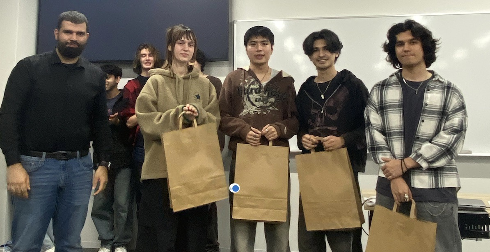
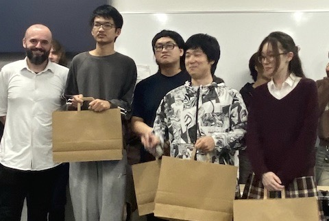
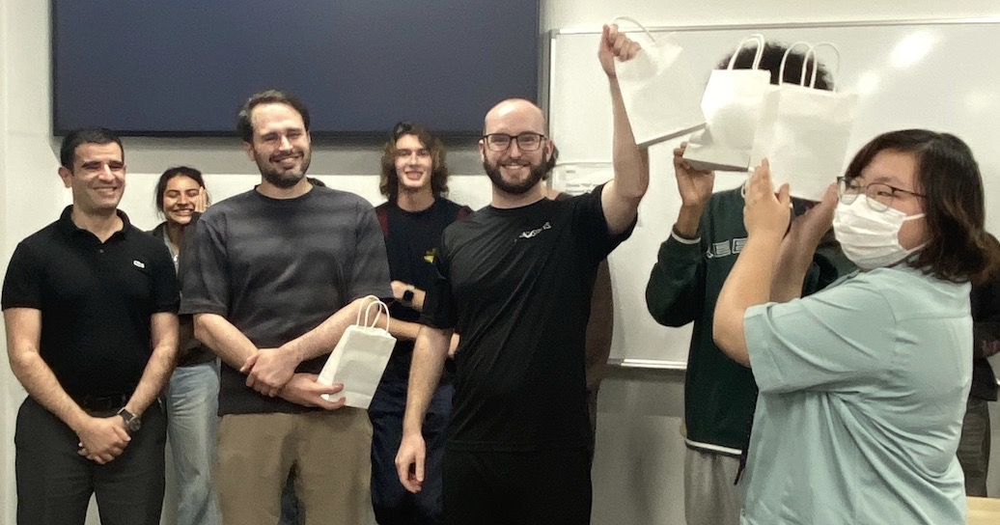

# Introduction 

The TUJ Fall 2025 Hackathon was the second biggest Hackathon TUJ CS Society had the opportunity to host. This was supposed to be our first time offering a unique theme, different tracks, a bigger budget, and tech gadget prizes for all the participants. 

[TUJ Fall 2025 Hackathon DevPost](https://tuj-fall-2025-hackathon.devpost.com/)

--- 
# Themes

The theme of this Hackathon was **Code for Good**. This was the general/overall theme of the hackathon, code for the sake of code, code code that helps the community, and benefits the people around you.

The two tracks under this general overarching theme were: 

1. **Application Track**: Create an application/solution to help the local community around you or to solve a problem that you see right now that you think can be fixed/helped. Make something to help the community, or aid in improving it.

2. **Game Track**: Create a game that helps with mental health, reduces stress, and overall is a relaxing, enjoyable game. Most games are quite fast-paced, action-heavy, etc., we want you to move away from that idea, and develop something more calm, relaxing, and something that people can go and play without feeling under any stress or pressure.

This was a more limiting theme this time only allowing participants to make either applications or games. This would make it much harder to judge and rank teams for the judges, however, it was still exciting to see all the different ways participants and teams had innovative projects to fit the main theme of the Hackathon. 

---
# Teams and Projects 

The full gallery of all projects submitted at this Hackthon can be found here: 

[DevPost Hackathon Gallery](https://tuj-fall-2025-hackathon.devpost.com/project-gallery)

| | | |
|:------:|:------:|:------:|

---
# Winners

What's really interesting this time is that we had winners from all years throughout the university, we had first year student winners, second year students, third, and fourth year students as well. Everyone had an interesting, unique, and powerful idea to show, and for me it was very exciting. 

## Application Track Winners

| | | |
|:------:|:------:|:------:|
|  |  |  |
| 1st Place - GuardianLens: Kseniya Chadovich, Ryuto Thai, Miguel Reyes Nakasone, and Daniel Morales Matsuzaki | 2nd place - Share Food: Celia Ran, Felix Zhang, and Kaen Zhang | 3rd place - ACBGPS: Casey Borngesser, James Donnelly, Fangyan Fu, Thomas Nitcheu |
| [GuardianLens Project](https://www.linkedin.com/posts/kseniya-chadovich19_hackathon-templeuniversityjapan-ai-ugcPost-7391325108008751104-0lNF/) | [Share Food Project](https://devpost.com/software/share-food) | [ACBGPS Project](https://devpost.com/software/amazing-creative-beautiful-grocery-price-scraper-acbgps) |

## Game Track Winners

1st Place - Feed a Fish: Pramista KC, Dipesh Nihure, Quinn Cohen, and Alex Samlaska

[Their Project](https://devpost.com/software/feed-a-fish)

---
# Author Comments

Written by Bhushith Gujjala Hari

Overall, I loved this Hackathon, it was the second one I've ever organized and hosted, and it was the really fun. We had a big audience who came to just watch the project showcase, we had the professors support for judging, and of course, we had the most food this time offering both pizzas and donuts. We also had tech gadgets and computer peripherals as prizes this time, so it was a very memorable Hackathon and I was happy to see every team participate!

