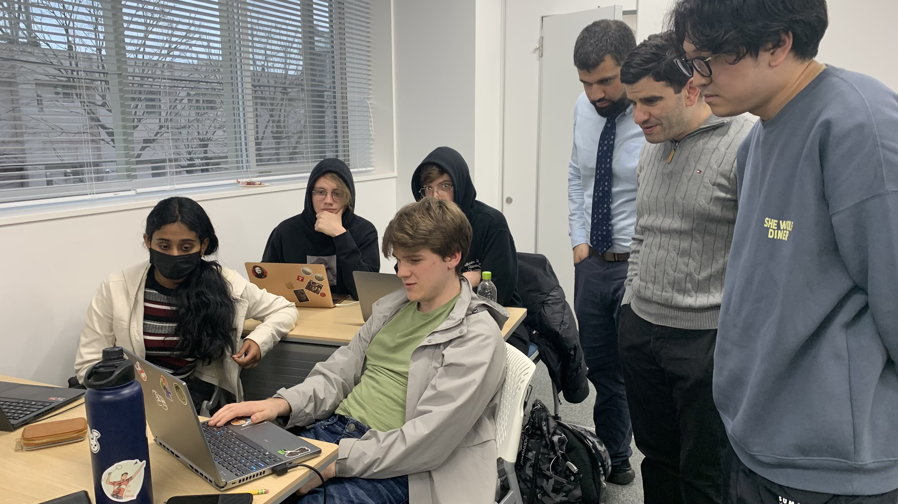
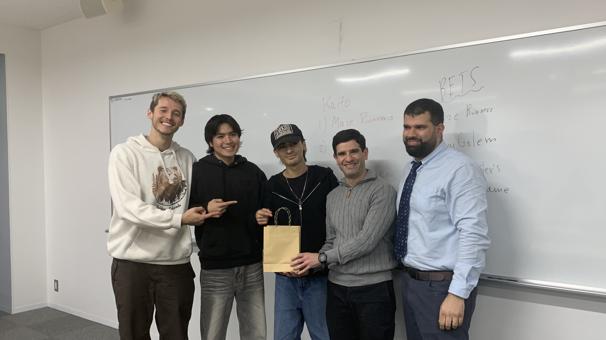
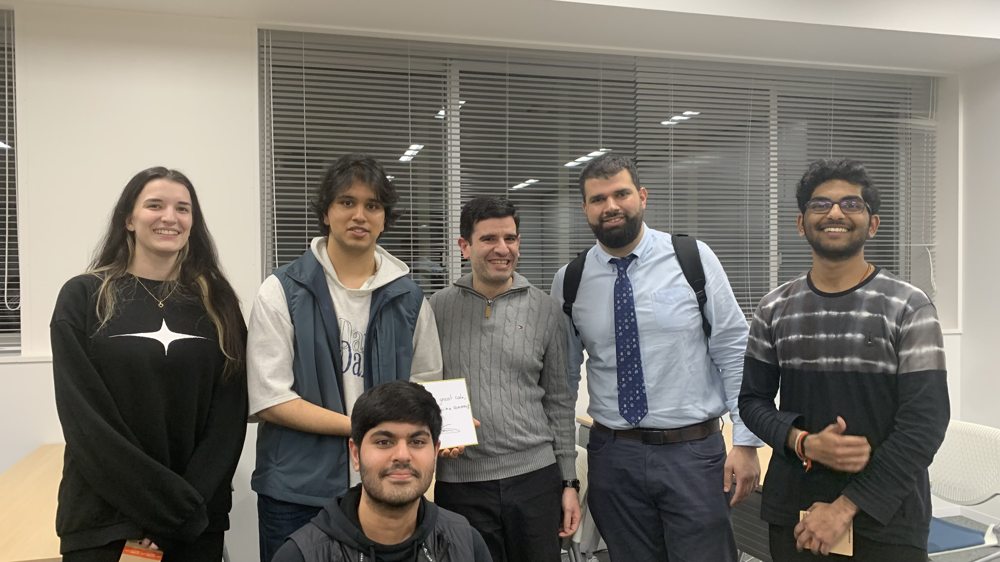
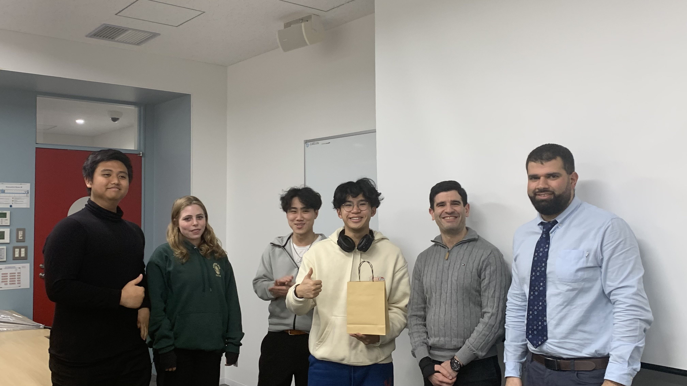
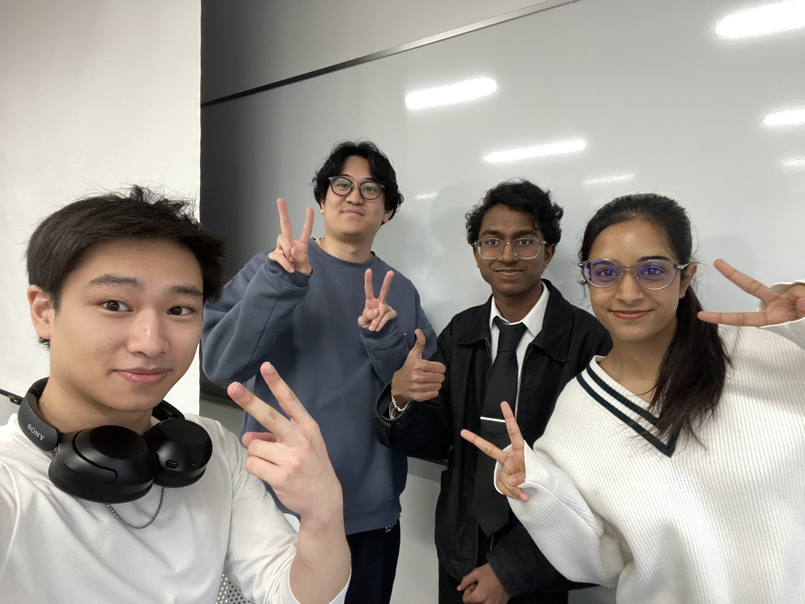

---
# Introduction
Temple University Japan Campus (TUJ) had the university's first Hackathon on March 29, 2025. It was a mini game jam Hackathon. This was going to be my first time co-organizing and co-hosting a Hackathon with the previous leaders of the Computer Science Society. I was equally nervous and excited for this event. 

---
# First Event 
For a first event, we did not have a huge budget, we didn't have a lot of interesting prizes, just mainly giftcards, but however, the theme, the setting, the scale of the event, and the whole Hackathon was incredibly fun for everyone. 

The theme especially made it quite fun for everyone, it was "The Game is a Liar". Participants had to make games that would trick the player. 

We did have snacks, refreshments, drinks, but the main appeal of the event was to have fun, code something within just 9 hours, and make a fun project for everyone. 

--- 
# Teams and Projects
We instructed teams to use PyGame, because it was the most easy to pick up, and suited the fast paced one day time limit of the Mini Hackathon / Game Jam. 

Every team had an unique approach to the challenge, some teams were making a spinoff of an existing game, making games with a twist, making a completely new game with new rules, and so many more interesting projects. 

---
# Winners 
Unfortunately, as fun, interesting, and well made each team's projects were, we have to pick favourites. As is the case with every Hackathon, I encourage people to participate regardless, and still take home the fun times, experience of being part of a hackathon, and the opportunities to network that come with it. 

But, I am happy to announce these teams were the winners of our first Hackathon selected by the judges! All of whom are good friends of mine, which made me very proud.

| 2nd | 1st | 3rd |
| :---: | :---: | :---: |
|  |  |   |
| _(Left to Right) Thomas Ishida, Ryuto Thai, Miguel Reyes Nakasone, Professor Hani Karam, and Professor Farid Nakhle_ | _(Left to Right) Bettina Marksteiner, Riju Pant, Jaideep Uppal, Sushant Bharadwaj Kagolanu, Professor Hani Karam, and Professor Farid Nakhle_ | _(Left to Right) Jay Sidka Abimanyu, Alisa Sumwalt, Alonzo Rico, Matthew Wong-Chie, Professor Hani Karam, and Professor Farid Nakhle_ |

---
# Author Comments
Written by Bhushith Gujjala Hari.

It was a great event. It did incredibly well for the TUJ CS Society's first proper large scale event at TUJ. It was a huge step in the right direction in terms of Hackathons. 

I was incredibly nervous when organizing this Hackathon, but I made sure to get the details right, and was able to pull off a successful event on my first try. 

## Key Takeaways

I learnt a lot of crucial skills at this Hackathon. A few notable things to me were time-management, event-management, how to keep up with multiple teams that are taking part in the competition, and how to handle stress. 

## Organizers

This was the first official TUJ CS Society team, and now most of my friends have graduated, but we were very happy to have pulled off a full event before that semester. I am happy I was given this opportunity, and I hope I do justice to the CS society in the future, organize more events, give TUJ students the recognition they deserve, and do more for the entire community, not only for the CS students, but for all students at TUJ.

